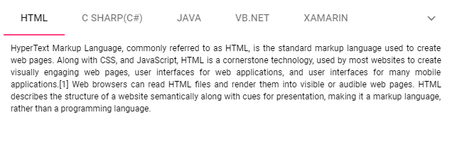

# Adaptive in ##Platform_Name## Tab control

The following section explains how to render the Tab when its width exceeds the viewable area, or for a specified [`width`](../api/tab#width). The available modes are as follows:

* Scrollable
* Popup
* MultiRow
* Extended

## Scrollable

The default [`overflowMode`](../api/tab#overflowmode) is Scrollable. The Scrollable display mode supports displaying the Tab header items in a single line with horizontal scrolling enabled when the items overflow the available space.

* The right and left navigation arrows are added at the start and end of the Tab header, allowing the user to navigate towards overflowed items in the Tab header.
* You can also view the overflowed items using touch and swipe actions on the header and content section.
* By default, the navigation icon in the left direction is disabled, but you can view the overflowed items by moving in the right direction.
* By clicking or holding the arrow continuously, you can view the overflowed items.

* In devices the navigation icons are not available. You can touch and swipe to see the overflowed items of the Tab header.



 







        
















## Popup

The Popup is another type of [`overflowMode`](../api/tab#overflowmode) in which the Tab container holds items that can be accommodated within the available space. The rest of the overflowing items, for which there is no space to fit within the viewing area, are moved to an overflow popup container.

* The items placed in the popup can be viewed by opening the popup using the drop-down icon at the end of the Tab header.
* If the popup height exceeds the visible area height, you can scroll through the popup items and select one.



 







        
















## MultiRow

The `MultiRow` display mode allows the Tabs to wrap the toolbar items to the next line when the available space is exhausted. This mode is ideal for scenarios where space is limited, but all commands need to be visible at once.

* The Tabs automatically arranges the items into multiple lines without the need for scrolling.
* This ensures that users have immediate access to all Tab items without additional interaction such as scrolling or clicking a popup.











        
















## Extended

`Extended` mode hides the overflowing Tab items in a subsequent row. Users can access these items by clicking on expand icons provided at the end of the Tab.

* In this mode, the Tab maintains a clean top row and allows extra items to be rendered into additional rows.
* Clicking the expand icons will dynamically adjust the Tab to reveal hidden toolbar items.
* If the popup content overflows the height of the page, remaining elements will be hidden.











        
















## See Also

* [How to prevent content swipe selection](./how-to/prevent-content-swipe-selection/)
* [Collapsible Tab](./how-to/create-collapsible-tabs/)