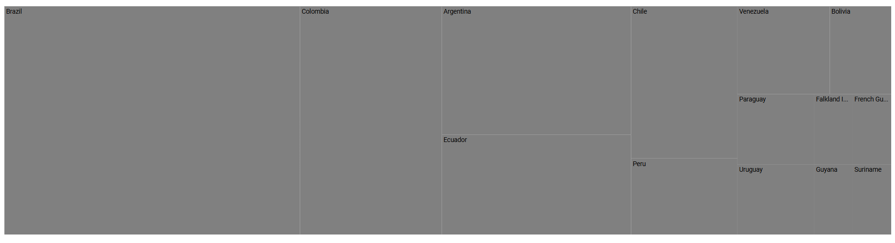

# Getting Started with Syncfusion® JavaScript (ES5) TreeMap Component

Build your first Syncfusion JavaScript (ES5) application with a TreeMap in a few minutes. This quickstart guides you through creating a minimal HTML page, loading the required Syncfusion scripts from the CDN, mapping a flat data source, and rendering proportional rectangular items.

## Prerequisites

* [Visual Studio Code](https://code.visualstudio.com) or another text editor
* A modern web browser
* A local web server, such as the Visual Studio Code [Live Server](https://marketplace.visualstudio.com/items?itemName=ritwickdey.LiveServer) extension

> Register your Syncfusion license key before using the component. For more information, refer to the [license key registration documentation](https://ej2.syncfusion.com/documentation/licensing/license-key-registration).

## Dependencies

The TreeMap component is available in the `@syncfusion/ej2-treemap` package. The following dependencies are required:

```text
|-- @syncfusion/ej2-treemap
    |-- @syncfusion/ej2-base
    |-- @syncfusion/ej2-data
    |-- @syncfusion/ej2-svg-base
    |-- @syncfusion/ej2-pdf-export
```

## Quick Setup

### Step 1: Create the Folder and Files

Create a folder named `quickstart` in your preferred directory.

Inside the `quickstart` folder, create the following files:

* `index.html`
* `index.js`

### Step 2: Add Syncfusion® CDN Resources

You can load the TreeMap component by using individual package scripts or the combined Syncfusion bundle. Choose only one of these approaches.

#### Individual Package Scripts

Add the following script references to the `<head>` section of `index.html`. Load the dependencies before the TreeMap component script.

```html
<script src="https://cdn.syncfusion.com/ej2/33.2.3/ej2-base/dist/global/ej2-base.min.js" type="text/javascript"></script>
<script src="https://cdn.syncfusion.com/ej2/33.2.3/ej2-data/dist/global/ej2-data.min.js" type="text/javascript"></script>
<script src="https://cdn.syncfusion.com/ej2/33.2.3/ej2-svg-base/dist/global/ej2-svg-base.min.js" type="text/javascript"></script>
<script src="https://cdn.syncfusion.com/ej2/33.2.3/ej2-treemap/dist/global/ej2-treemap.min.js" type="text/javascript"></script>
```
#### Combined Bundle

Alternatively, load all Syncfusion JavaScript components from a single combined bundle:

```html
<script src="https://cdn.syncfusion.com/ej2/33.2.3/dist/ej2.min.js" type="text/javascript"></script>
```

> Do not include the combined bundle together with the individual package scripts.

### Step 3: Add the Syncfusion® TreeMap Control to the Application

The `index.html` file contains the TreeMap container and references a separate `index.js` file that contains the component initialization.

The global scripts added in Step 2 register the `ej.treemap.TreeMap` class in the `ej` namespace. Therefore, no module imports are required.










The `new ej.treemap.TreeMap({...})` call creates the TreeMap component. The configuration object uses the following key properties:

- [`dataSource`](https://ej2.syncfusion.com/javascript/documentation/api/treemap/index-default#datasource) — Specifies the collection of records displayed by the TreeMap.
- [`weightValuePath`](https://ej2.syncfusion.com/javascript/documentation/api/treemap/index-default#weightvaluepath) — Maps the numeric data field that determines each item's area.
- [`leafItemSettings`](https://ej2.syncfusion.com/javascript/documentation/api/treemap/index-default#leafitemsettings) — Configures the appearance and behavior of leaf items.
- [`labelPath`](https://ej2.syncfusion.com/javascript/documentation/api/treemap/leafitemsettingsmodel#labelpath) — Maps the data field displayed as each leaf item's label.

Finally, `treemap.appendTo('#container')` renders the component inside the `<div id="element">` element declared in `index.html`.

### Step 4: Open the Application in a Browser

Open `quickstart/index.html` through a local web server.

If you are using the Visual Studio Code **Live Server** extension:

1. Right-click `index.html` in the Explorer.
2. Select **Open with Live Server**.
3. Open the URL displayed by Live Server, such as `http://127.0.0.1:5500/`.

The browser displays the initialized TreeMap.

## Output

After completing the quick setup, the browser displays a TreeMap.





## Troubleshooting

- **The page is blank.** Open `index.html` through a local web server instead of opening the file directly from the file system.
- **`ej is not defined`.** Ensure that the Syncfusion CDN scripts are loaded before `index.js`.
- **`ej.treemap` is undefined.** Verify that `ej2-treemap.min.js` is loaded after `ej2-base.min.js`, `ej2-data.min.js`, and `ej2-svg-base.min.js`.
- **The TreeMap is empty.** Confirm that `dataSource` contains records and that `weightValuePath` maps to a numeric field in every record.
