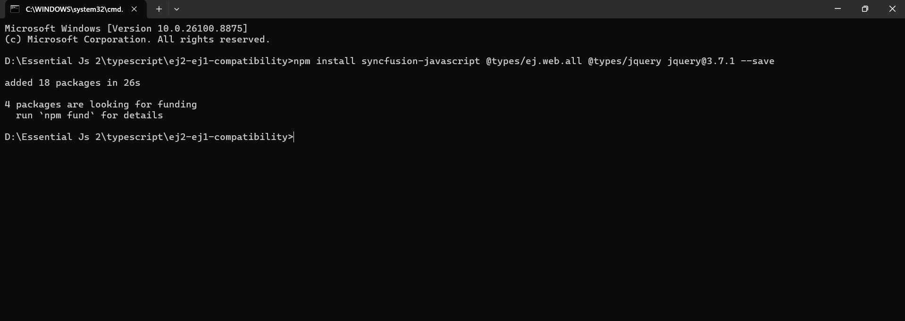
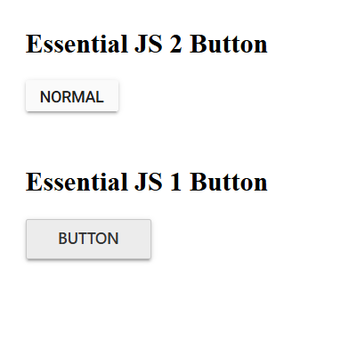

# Compatibility with Syncfusion® JS (Essential® JS 1)

This article provides a step-by-step introduction to configuring the Essential<sup style="font-size:70%">&reg;</sup> JS 1 and Essential<sup style="font-size:70%">&reg;</sup> JS 2 JavaScript controls on the same web page.

## Prerequisites

To use Essential<sup style="font-size:70%">&reg;</sup> JS 1 and Essential<sup style="font-size:70%">&reg;</sup> JS 2 controls together in JavaScript, the following system requirements must be met:

* [Essential<sup style="font-size:70%">&reg;</sup> JS 1 Dependencies](https://help.syncfusion.com/js/dependencies)
* [Node.js](https://nodejs.org/en/)
* [Visual Studio Code](https://code.visualstudio.com/)

## Creating a JavaScript application with the Essential<sup style="font-size:70%">&reg;</sup> JS 2 control

1.You can create a JavaScript application with the help of the given Essential<sup style="font-size:70%">&reg;</sup> JS2 [getting started documentation](./quick-start).

2.Now the Essential<sup style="font-size:70%">&reg;</sup> JS 2 Button control rendered successfully in the web page.

## Adding the Essential<sup style="font-size:70%">&reg;</sup> JS 1 control to the JavaScript application

1.Install the Essential<sup style="font-size:70%">&reg;</sup> JS 1 npm package with the required dependent typing package in the JavaScript quick start application.

```
npm install syncfusion-javascript @types/ej.web.all @types/jquery jquery@3.7.1 --save
```

 

2.Add the HTML Button element inside the `<body>` element in the `~/src/index.html` for rendering Essential<sup style="font-size:70%">&reg;</sup> JS 1 Button control.

 ```

<head>
    .....
    .....
    <link href="http://cdn.syncfusion.com/16.1.0.24/js/web/flat-azure/ej.web.all.compatibility.min.css" rel="stylesheet" type="text/css" />

</head>
<body>
    ....
    ....

    <div style="margin: 50px;">
        <h2>Essential JS 2 Button</h2>
        <!--Essential JS 2 button-->
        <button id="ej2button">NORMAL</button>
    </div>
    <div style="margin: 50px;">
        <h2>Essential JS 1 Button</h2>
        <!--Essential JS 1 button-->
        <button id="button">BUTTON</button>
    </div>
</body>
 ```

> Refer to this [documentation](https://help.syncfusion.com/js/dependencies) to know more about Essential<sup style="font-size:70%">&reg;</sup> JS 1 dependencies.

3.After adding the HTML Button element, Add the Essential<sup style="font-size:70%">&reg;</sup> JS 1 compatibility style references in the `styles.css` file.

> The compatibility styles of Essential<sup style="font-size:70%">&reg;</sup> JS 1 and Essential<sup style="font-size:70%">&reg;</sup> JS 2 must be added in the application to prevent the UI conflicts between the Essential<sup style="font-size:70%">&reg;</sup> JS 1 and Essential<sup style="font-size:70%">&reg;</sup> JS 2 controls.

Replace the `style.css` file content with the below style references.

  ```
    @import '../../node_modules/@syncfusion/ej2/styles/compatibility/material.css';
  ```

4.Add the Essential<sup style="font-size:70%">&reg;</sup> JS 1 type reference to the `types` compiler options in `~/tsconfig.json` file.

```
{
    "compilerOptions": {
        "types": ["ej.web.all"]
    }
}
 ```

5.Expose jQuery on the global scope. The Essential<sup style="font-size:70%">&reg;</sup> JS 1 bundle (`ej.web.all.min.js`) reads `window.jQuery`/`window.$` directly, but webpack only ships jQuery as a module import. Create a new file `~/src/app/jquery-global.ts` that imports jQuery and assigns it to `window`:

  ```ts
    import * as $ from "jquery";

    (window as any).$ = $;
    (window as any).jQuery = $;

    export {};
  ```

6.Register the jQuery global file as the first entry in `~/webpack.config.js` so it runs before `ej.web.all.min.js`. Add `webpack` to the requires and add the `ProvidePlugin` so any module referencing the bare identifier `jQuery`/`$` is automatically injected:

  ```js
    const HtmlWebpackPlugin = require("html-webpack-plugin");
    const MiniCssExtractPlugin = require("mini-css-extract-plugin");
    const webpack = require("webpack");
    const path = require('path');

    module.exports = {
        entry: ['./src/app/jquery-global.ts', './src/app/app.ts', './src/styles/styles.css'],
        // ...rest of the config...
        plugins: [
            new HtmlWebpackPlugin({
                template: 'src/index.html'
            }),
            new MiniCssExtractPlugin({
                filename: "bundle.css"
            }),
            new webpack.ProvidePlugin({
                $: 'jquery',
                jQuery: 'jquery',
                'window.jQuery': 'jquery'
            })
        ],
    };
  ```

  > The `ProvidePlugin` is what makes the legacy Essential<sup style="font-size:70%">&reg;</sup> JS 1 bundle work even if other code paths evaluate `ej.web.all.min.js` first.

7.Now, import the Essential<sup style="font-size:70%">&reg;</sup> JS 1 script, jQuery, and the Essential<sup style="font-size:70%">&reg;</sup> JS 2 Button, and create the Essential<sup style="font-size:70%">&reg;</sup> JS 1 Button control in the `~/src/app/app.ts` file.

 ```ts
    import "syncfusion-javascript/Scripts/ej/web/ej.web.all.min.js";

    import { Button as EJ2Button } from "@syncfusion/ej2-buttons";

    import $ from "jquery";

    declare const ej: any;

   // Render Essential JS 2 Button
    let ej2Button: EJ2Button = new EJ2Button({ content: "NORMAL" });
    ej2Button.appendTo("#ej2button");

   // Render Essential JS 1 Button
   $(function () {
       $("#button").ejButton({
           size: "medium",
           showRoundedCorner: true,
       });
   });
  ```

  > jQuery is made available on `window` by `~/src/app/jquery-global.ts` (the first webpack entry) and by `webpack.ProvidePlugin`, so the legacy `ej.web.all.min.js` bundle can find it.

8.Finally, run the below command line and it will open the web application in the web browser.

 ```
npm start
 ```

The Essential<sup style="font-size:70%">&reg;</sup> JS 1 and Essential<sup style="font-size:70%">&reg;</sup> JS 2 Button control will be rendered in the same web page.


