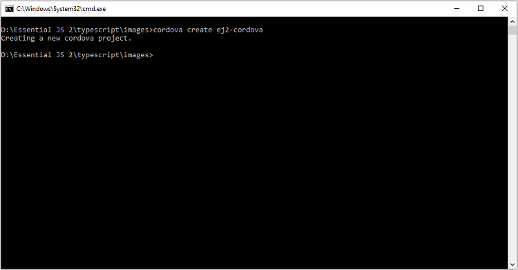
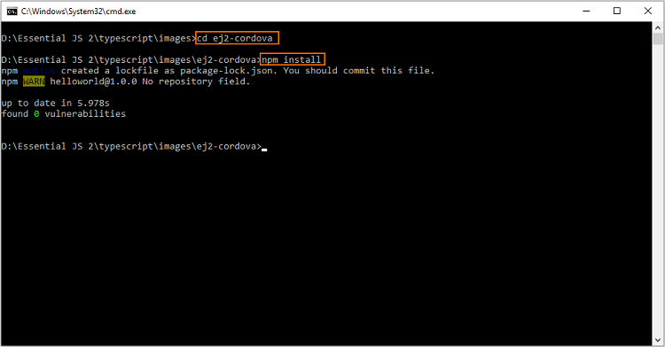
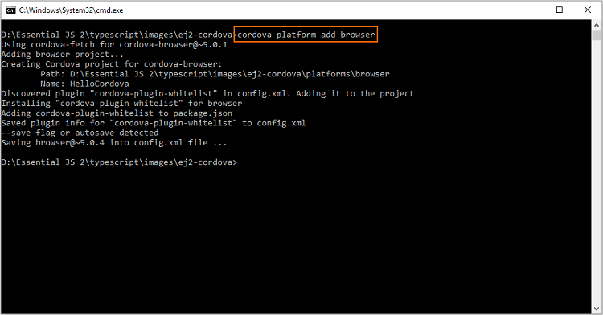
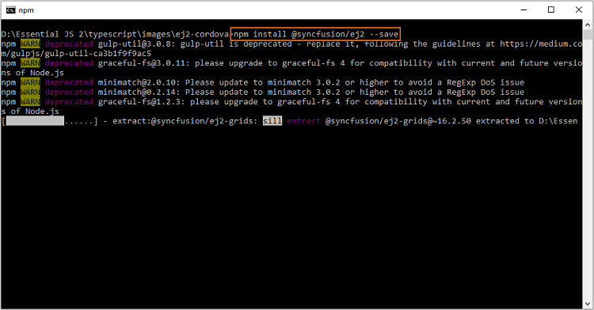
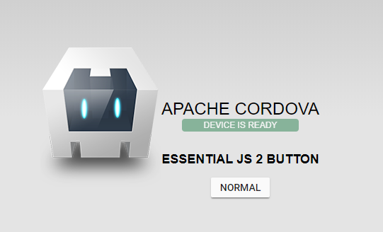

# Getting Started with Syncfusion JavaScript (Essential JS 2) library and Cordova

This article provides a step-by-step introduction to configure Syncfusion JavaScript (Essential JS 2) library and build it in the Cordova framework.

## Getting started with Cordova CLI

### Prerequisites

* [Node.js](https://nodejs.org/en/)
* [Visual Studio Code](https://code.visualstudio.com/)

### Setup development environment

1. Open command prompt, and run the following command line to install the `cordova` with global flag.

    on Windows:

    ```
    npm install -g cordova
    ```

    on OSX / LINUX:

    ```
    sudo npm install -g cordova typescript
    ```

2. Create a new Cordova application by running the following command line. A new Cordova application will be created under `ej2-cordova` folder.

    ```
    cordova create ej2-cordova
    ```

    

3. Navigate to the application folder, and install the required default dependencies using the following command line from command prompt.

    ```
    cd ej2-cordova
    npm install
    ```

    

4. Run the following command line in the command prompt to install the required platforms. For getting started, the browser platform has been installed in this application.

    ```
    cordova platform add browser
    ```

    

    > The command line `cordova platform add browser` adds cordova platform browser.

5. Open the application in Visual Studio Code, and configure the TypeScrit compilation settings by adding the following code snippets in `~/tsconfig.json` file.

    ```
    {
        "compilerOptions": {
            "target": "es5",
            "module": "amd",
            "removeComments": true,
            "noLib": false,
            "sourceMap": true,
            "pretty": true,
            "allowUnreachableCode": false,
            "allowUnusedLabels": false,
            "noImplicitAny": true,
            "noImplicitReturns": true,
            "noImplicitUseStrict": false,
            "noFallthroughCasesInSwitch": true,
            "allowJs": false,
            "noEmitOnError": true,
            "forceConsistentCasingInFileNames": true,
            "moduleResolution": "node",
            "suppressImplicitAnyIndexErrors": true,
            "outFile": "./www/js/ej2.js",
        },
        "files": [
          "www/ts/ej2.ts"
        ],
        "compileOnSave": false
    }
    ```

    > The above configuration can be used to compile the TypeScript files into JavaScript AMD (Asynchronous Module Definition) modules. The `files` and `outFile` compiler options are used to integrate the input and output file references. Refer to this [documentation](https://www.typescriptlang.org/docs/handbook/tsconfig-json.html) for more information about the TypeScript `tsconfig.json` file.
    >
    > The AMD module can be loaded using [`RequireJS`](http://requirejs.org/) in this application.

6. Add the `RequireJS` library script reference at the end of `<body>` element in `~/www/index.html` file.

    ```
    <body>
        ....
        ....
        <script type="text/javascript" src="cordova.js"></script>
        <script type="text/javascript" src="js/index.js"></script>
        <!-- RequireJS library reference -->
        <script type="text/javascript" src="https://cdnjs.cloudflare.com/ajax/libs/require.js/2.3.5/require.min.js"></script>
    </body>
    ```

7. Then, add the following node script in the `~/package.json` file script section for compiling TypeScript.

    ```
    {
        ....
        ....
        "scripts": {
            ....
            ....
            "build": "tsc --build tsconfig.json"
        }
        ....
        ....
    }
    ```

### Configure Syncfusion JavaScript UI control in application

1.Install [`@syncfusion/ej2`](https://www.npmjs.com/package/@syncfusion/ej2) npm package in the application using the following command line.

 ```
    npm install @syncfusion/ej2 --save
 ```



2.Add the Syncfusion JavaScript UI cotrols in the application. For getting started, the Button control is added in the application `~/www/index.html` file.

 ```html
     <!DOCTYPE html>
    <html lang="en">

    <head>
        ....
        ....
    </head>

    <body>
        <div class="app">
            <h1>Apache Cordova</h1>
            ....
            ....
            <div>
                <h2>Essential JS 2 Button</h2>
                <!--HTML button element, which is going to render as Essential JS 2 Button-->
                <button id="normalbtn">Normal</button>
            </div>
        </div>
        ....
        ....
    </body>

    </html>
 ```

3.Now, create a folder `~/www/ts`, and render the Button control using following TypeScript code in the `~/www/ts/ej2.ts` file.

 ```ts
    import { Button } from '@syncfusion/ej2-buttons';

    // initialize button control
    let button: Button = new Button();

    // render initialized button
    button.appendTo('#normalbtn');
 ```

    > This `~/www/ts/ej2.ts` file reference has already been added in the `files` option of `~/tsconfig.json` file.

4.Add the Syncfusion JavaScript style reference inside the `<head>` element in the `~/www/index.html` file.

 ```
    <head>
        ....
        ....
        <!-- Essential JS 2 styles -->
        <link rel="stylesheet" type="text/css" href="http://cdn.syncfusion.com/ej2/material.css">
    </head>
 ```

5.Now, run the following command line to compile the TypeScript file into JavaScript AMD module file. The compiled JavaScript output file will be placed in `~/www/js/ej2.js`.

 ```
    npm run build
 ```

    > This node script has already been configured in the `~/package.json` file's `scripts` section.

6.After compiling TypeScript file, add the `RequireJS` configurations in the script reference at the end of `<body>` element in `~/www/index.html` file.

 ```
    <body>
        ....
        ....
        <!-- RequireJS library reference -->
        <script type="text/javascript" src="https://cdnjs.cloudflare.com/ajax/libs/require.js/2.3.5/require.min.js" data-main="js/ej2"></script>
        <script>
            // Require.js configuration
            requirejs.config({
                paths: {
                    // Syncfusion Essential JS 2 button control UMD file location
                    "@syncfusion/ej2-base": "../node_modules/@syncfusion/ej2-base/dist/ej2-base.umd.min",
                    "@syncfusion/ej2-buttons": "../node_modules/@syncfusion/ej2-buttons/dist/ej2-buttons.umd.min"
                }
            });
        </script>
    </body>
 ```

    > The `data-main` attribute in `RequireJS` script reference is used to load the entry point of the AMD file in the application, and it will be loaded asynchronously at the run time. Refer to this [documentation](https://requirejs.org/docs/api.html#data-main) for more information about `data-main` attribute in `RequireJS`.
    >
    > The `paths` option should be configured with the package dependencies to resolve the path used inside module file. The Syncfusion JavaScript UI control dependencies are listed in the corresponding control's getting started documentation. Refer to this [documentation](https://ej2.syncfusion.com/documentation/button/getting-started.html#dependencies) to learn about the button control dependencies.
    >
    > The UMD (Universal Module Definition) module supports both [AMD](http://requirejs.org/) and [`CommonJS`](http://www.commonjs.org/). Refer to this [documentation](https://github.com/umdjs/umd) for more details about UMD module loading.

7.Finally, run the following command line to start the application. The button control will be rendered in the Cordova application.

 ```
    cordova run browser
 ```

 

    > The command line `npm run build & cordova run browser` will compile the TypeScript files and then run the application by a single step.

## Running on mobile emulator/simulator

### Android

1.The [Android SDK](https://developer.android.com/studio/) is required to run the Cordova application in Android emulator. Refer to this [Cordova documentation](https://cordova.apache.org/docs/en/8.x/guide/platforms/android/index.html) for more information about Android platform development in Cordava.

2.Run the following command line to add the Android platform in the Cordova application after installing the [required software](https://cordova.apache.org/docs/en/8.x/guide/platforms/android/index.html#installing-the-requirements).

  ```
    cordova platform add android
 ```

3.Then, run the following command line to start the Cordova application in Android emulator.

 ```
    cordova run android
 ```

### IOS

1.The [Xcode](https://itunes.apple.com/us/app/xcode/id497799835?mt=12) is required to run the Cordova application in IOS simulator. Refer to this [documentation](https://cordova.apache.org/docs/en/8.x/guide/platforms/ios/index.html) for more information about IOS platform development in Cordava.

2.After installing the [required software](https://cordova.apache.org/docs/en/8.x/guide/platforms/ios/index.html#installing-the-requirements), run the following command line to add the IOS platform in the Cordova application.

 ```
    cordova platform add ios
 ```

    > If this application need to be started in the OSX configuration, add it using the command line `cordova platform add osx`. Refer to this [documentation](https://cordova.apache.org/docs/en/8.x/guide/platforms/osx/index.html) for more information about OSX platform development in Cordova.

3.Now, run the following command line to start the Cordova application in IOS simulator.

 ```
    cordova run ios
 ```

### Windows

1.Run the following command line to add the Windows platform in the Cordova application after installing the [required software](https://cordova.apache.org/docs/en/8.x/guide/platforms/windows/index.html#requirements-and-support).

 ```
    cordova platform add windows
 ```

2.Then, run the following command line to start the Cordova application in Windows emulator.

 ```
    cordova run windows
 ```

> Refer to this [documentation](https://cordova.apache.org/docs/en/8.x/guide/platforms/windows/index.html) for more information about Windows platform development in Cordova.
