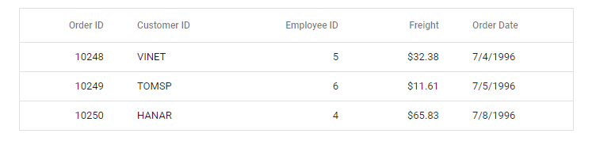

# Getting Started with Electron Framework in Typescript

[Electron](https://www.electronjs.org/docs/latest/) is a framework that allows you to build cross-platform desktop applications using JavaScript, HTML, and CSS. It includes Chromium and Node.js within its binary, enabling you to write a single JavaScript codebase that can run on Windows, macOS, and Linux platforms.

This section provides a step-by-step guide to configuring the Syncfusion JavaScript (Essential JS 2) library and building a simple [electron](https://www.electronjs.org/docs/latest/) application.

> This application is integrated with the `webpack.config.js` configuration and uses the latest version of the [webpack-cli](https://webpack.js.org/api/cli/#commands). It requires node `v14.15.0` or higher. For more information about webpack and its features, refer to the [webpack documentation](https://webpack.js.org/guides/getting-started/).

## Prerequisites

To get started with application, ensure the following software to be installed in the machine.

* [Node.js](https://nodejs.org/en/)
* [Visual Studio Code](https://code.visualstudio.com/)

## Set up development environment

* Open the command prompt in your desired location. To create the application folder, use the following commands.

  ```

  mkdir ej2-electron

  cd ej2-electron

  ```

* Create a `package.json` file and install the required packages in the application using the following commands.

  ```
  npm init -y

  npm i  --save-dev electron typescript ts-loader webpack webpack-cli
  ```

* Then, create a default `tsconfig.json` file in the application using the following command.
    
  ```
  tsc --init
  ```

## Add Syncfusion packages

All Syncfusion JavaScript (Essential JS 2) packages are published on the [npmjs.com](https://www.npmjs.com/~syncfusionorg) public registry. So, choose the desired control to install. In this getting started, the Grid control is used as an example. To install the Grid control package, use the following command.

```

npm i @syncfusion/ej2-grids

```

> Check out the [installation and upgrade](https://ej2.syncfusion.com/documentation/installation-and-upgrade/installation/) section to learn about the different ways of installing the packages.

## Import the Syncfusion CSS styles

After installing the Syncfusion control packages in the application, create a `~/style.css` file in the application root directory then add the required theme based on the controls used. 

Syncfusion JavaScript controls comes with [built-in](https://ej2.syncfusion.com/documentation/appearance/theme/) themes, which are available in installed packages. It is easy to adapt the Syncfusion JavaScript controls based on the application style by referring to any of the [built-in](https://ej2.syncfusion.com/documentation/appearance/theme/) themes. 

Open the application in Visual Studio Code and import the `Material` theme for the Grid control and its dependencies to the `~/style.css` file as follows.

```css
  @import "node_modules/@syncfusion/ej2-base/styles/material.css";
  @import "node_modules/@syncfusion/ej2-buttons/styles/material.css";
  @import "node_modules/@syncfusion/ej2-calendars/styles/material.css";
  @import "node_modules/@syncfusion/ej2-dropdowns/styles/material.css";
  @import "node_modules/@syncfusion/ej2-inputs/styles/material.css";
  @import "node_modules/@syncfusion/ej2-navigations/styles/material.css";
  @import "node_modules/@syncfusion/ej2-popups/styles/material.css";
  @import "node_modules/@syncfusion/ej2-splitbuttons/styles/material.css";
  @import "node_modules/@syncfusion/ej2-grids/styles/material.css";
```

> Grid control have dependencies on other Syncfusion controls, so CSS references for the dependent control must be added in order to use all Grid functionalities. Check out the [themes](https://ej2.syncfusion.com/documentation/appearance/theme/) section to know more about built-in themes and combined CSS reference of all controls.

## Add Syncfusion control to the application

Create a `~/index.html` file in the application root directory and add the following code snippet.

```html
<!DOCTYPE html>
<html>
  <head>
    <meta charset="UTF-8">
    <title>Electron</title>
    <link href="./style.css" rel="stylesheet">
  </head>

  <body>
    We are using Node.js <span id="node-version"></span>,
    Chromium <span id="chrome-version"></span>,
    and Electron <span id="electron-version"></span>.

    <div id="container" style="margin:0 auto; width:300px;">
        <!--HTML grid element, which is going to render as Essential JS 2 Grid-->
        <div id="Grid"></div>
    </div>

    <script src="./dist/renderer-bundle.js"></script>
  </body>

</html>
```

Create a `~/src` folder and add the `renderer.ts` file inside it. Then, include the Syncfusion JavaScript Grid control in the `renderer.ts` file as follows,

```ts
import { Grid } from '@syncfusion/ej2-grids';


document.addEventListener("DOMContentLoaded", function() { 
 // Grid data
    const data: Object[] = [
        {
            OrderID: 10248, CustomerID: 'VINET', EmployeeID: 5, OrderDate: new Date(8364186e5),
            ShipName: 'Vins et alcools Chevalier', ShipCity: 'Reims', ShipAddress: '59 rue de l Abbaye',
            ShipRegion: 'CJ', ShipPostalCode: '51100', ShipCountry: 'France', Freight: 32.38, Verified: !0
        },
        {
            OrderID: 10249, CustomerID: 'TOMSP', EmployeeID: 6, OrderDate: new Date(836505e6),
            ShipName: 'Toms Spezialitäten', ShipCity: 'Münster', ShipAddress: 'Luisenstr. 48',
            ShipRegion: 'CJ', ShipPostalCode: '44087', ShipCountry: 'Germany', Freight: 11.61, Verified: !1
        },
        {
            OrderID: 10250, CustomerID: 'HANAR', EmployeeID: 4, OrderDate: new Date(8367642e5),
            ShipName: 'Hanari Carnes', ShipCity: 'Rio de Janeiro', ShipAddress: 'Rua do Paço, 67',
            ShipRegion: 'RJ', ShipPostalCode: '05454-876', ShipCountry: 'Brazil', Freight: 65.83, Verified: !0
        }
    ];

    // initialize grid control
    let grid: Grid = new Grid({
        dataSource: data,
        columns: [
                { field: 'OrderID', headerText: 'Order ID', textAlign: 'Right', width: 120, type: 'number' },
                { field: 'CustomerID', width: 140, headerText: 'Customer ID', type: 'string' },
                { field: 'EmployeeID', width: 140, headerText: 'Employee ID', textAlign: 'Right', type: 'string' },
                { field: 'Freight', headerText: 'Freight', textAlign: 'Right', width: 120, format: 'C' },
                { field: 'OrderDate', headerText: 'Order Date', width: 140, format: 'yMd' }
        ]
    });

    // render initialized grid
    grid.appendTo('#Grid');
});
```

## configure electron application

Create a `~/main.ts` and `~/preload.ts` files in the application root directory. Then, add the following code in the `main.ts` file to create a new browser window in the electron application and load the `index.html` file.

```ts
import {app, BrowserWindow} from 'electron';
import * as path from 'path';

const createWindow = () => {
    const win = new BrowserWindow({
      width: 800,
      height: 600,
      webPreferences: {
        preload: path.join(__dirname, 'preload-bundle.js'),
      },
    });
    win.loadFile('index.html')
}

app.whenReady().then(() => {
    createWindow();
    app.on('activate', () => {
        if (BrowserWindow.getAllWindows().length === 0) createWindow();
    })
})

app.on('window-all-closed', () => {
    if (process.platform !== 'darwin') app.quit()
})

```

Open `preload.ts` file and add the following code snippet. In this file, you can access the `document` and `Node.js` APIs in the preload process.

```ts
// All of the Node.js APIs are available in the preload process.

window.addEventListener('DOMContentLoaded', () => {
    const replaceText = (selector: any, text: any) => {
      const element = document.getElementById(selector)
      if (element) element.innerText = text
    }
  
    for (const dependency of ['chrome', 'node', 'electron']) {
      replaceText(`${dependency}-version`, process.versions[dependency])
    }
})

```

> To know more about process model in the electron application, refer to the documentation [here](https://www.electronjs.org/docs/tutorial/process-model).

## Configure webpack

Create a `~/webpack.config.js` file in the application root directory and add the following code snippet.

```js
let common_config = {
    mode: 'development',
    module: {
        rules: [{
            test: /\.ts$/,
            use: [{ loader: 'ts-loader' }]
        }]
    },
};

module.exports = [
    Object.assign({}, common_config, {
        target: 'electron-main',
        entry: {
            main: './main.ts',
        },
        output: {
            filename: '[name]-bundle.js'
        },
    }),
    Object.assign({}, common_config, {
        target: 'electron-renderer',
        entry: {
            renderer: './src/renderer.ts',
        },
        output: {
            filename: '[name]-bundle.js',
        },
    }),
    Object.assign({}, common_config, {
        target: 'electron-preload',
        entry: {
            preload: './preload.ts',
        },
        output: {
            filename: '[name]-bundle.js',
        },
    })
]
```

## configure the package.json file

Modify the `main` and `scripts` fields in the `package.json` file as follows.


```js
  “main”: “./dist/main-bundle.js”,
  ...
  "scripts": {
    "build": "webpack --config webpack.config.js",
    "start": "npm run build && electron ."
  },

```

## Run the application

Now, run the application using the following command.
               
```
npm start
```



To learn more about the functionality of the Grid control, refer to the [Grid control](https://ej2.syncfusion.com/documentation/grid/getting-started/) section.

> [View sample in github](https://github.com/SyncfusionExamples/ej2-electron)

## See also

* [How to register Syncfusion License key in JavaScript(ES6) application](https://ej2.syncfusion.com/documentation/licensing/license-key-registration/)
