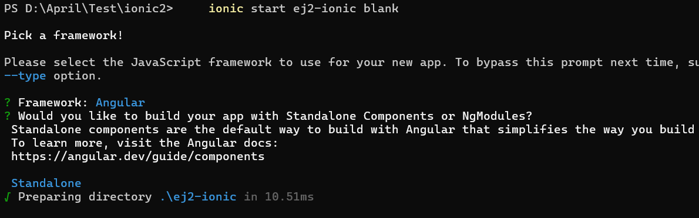
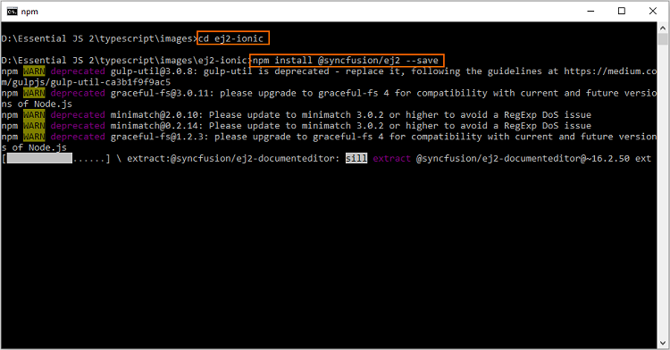
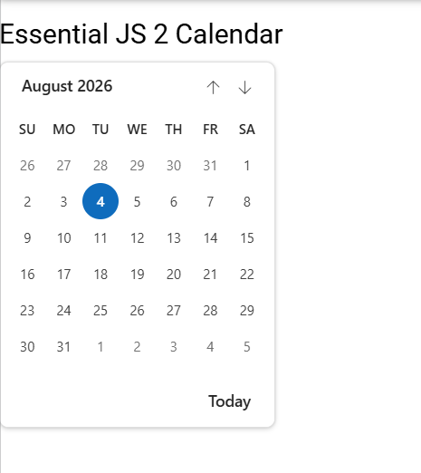

# Syncfusion® JavaScript (Essential® JS 2) library and Ionic Framework

This article explains how to integrate Syncfusion<sup style="font-size:70%">&reg;</sup> JavaScript (Essential<sup style="font-size:70%">&reg;</sup> JS 2) controls into an Ionic application.

## Prerequisites

* [Node.js](https://nodejs.org/en/)
* [Visual Studio Code](https://code.visualstudio.com/)

## Set up the development environment

1.Open the command prompt, and run the following command line to install the `ionic` with global flag.

on Windows:

 ```
npm install -g ionic cordova
 ```

on OSX / Linux:

 ```
sudo npm install -g ionic cordova
 ```

2.Then, run the following command line to create a new Ionic blank template application. The new application will be placed under `ej2-ionic` folder after the command complete its process, and it will install the default `npm` dependent packages when creating the application.

 ```
ionic start ej2-ionic blank
 ```

 When prompted to pick a framework and a component style, select **Angular** and **Standalone**. In 2026 the Ionic CLI defaults to Standalone components (the recommended way to build with Angular), so the generated project uses standalone components and `bootstrapApplication()` instead of NgModules.

 The list of available starter template can be listed by running `ionic start --list` command line.



## Configuring Syncfusion<sup style="font-size:70%">&reg;</sup> JavaScript UI control in application

1.Navigate to the `ej2-ionic` folder from the command prompt, and install the [`@syncfusion/ej2`](https://www.npmjs.com/package/@syncfusion/ej2) npm package in the application using the following command line.

 ```
cd ej2-ionic
npm install @syncfusion/ej2 --save
 ```

 

2.For getting started, the Calendar control will be added in the new application. Open the application in Visual Studio Code, and add the `<div>` element inside the `<ion-content>` element in `~/src/app/home/home.page.html` file for rendering the Calendar control.

 ```
<ion-header>
    ....
    ....
</ion-header>

<ion-content padding>
    ....
    ....

    <h2>Essential JS 2 Calendar</h2>
    <!--HTML element which is going to render as Essential JS 2 Calendar control-->
    <div id="element"></div>
</ion-content>
 ```

3.Import the Calendar class from `@syncfusion/ej2-calendars` package, and render the Calendar control inside the `platform.ready()` method's callback function of `HomePage` class in `~/src/app/home/home.page.ts` file. The component is declared as **standalone** (no `HomePageModule` is required).

 ```ts
import { Calendar } from "@syncfusion/ej2-calendars";
import { Component } from '@angular/core';
import { Platform } from '@ionic/angular';
import { IonicModule } from '@ionic/angular';

@Component({
    templateUrl: 'home.page.html',
    styleUrls: ['home.page.scss'],
    standalone: true,
    imports: [IonicModule]
})

export class HomePage {
    constructor(platform: Platform) {
        platform.ready().then(() => {
            // initialize calendar control
            let calendarObject = new Calendar();

            // render initialized calendar
            calendarObject.appendTo('#element');
        });
    }
}
```

> Because `HomePage` is now a standalone component, the helper files `~/src/app/home/home.module.ts` and `~/src/app/home/home-routing.module.ts` are **not required** and should be removed. The standalone `HomePage` is loaded directly by the router in step 7.

4.Replace the contents of `~/src/app/app.component.ts` so the standalone `AppComponent` imports `IonicModule` from `@ionic/angular`. This is what makes `ion-app` and `ion-router-outlet` known to Angular's template compiler, otherwise you will get the error:


 ```ts
import { Component } from '@angular/core';
import { IonicModule } from '@ionic/angular';

@Component({
  selector: 'app-root',
  templateUrl: 'app.component.html',
  styleUrls: ['app.component.scss'],
  standalone: true,
  imports: [IonicModule],
})
export class AppComponent {
  constructor() {}
}
 ```

5.Replace the contents of `~/src/app/app.module.ts` with a stub. The standalone `main.ts` bootstraps the app via `bootstrapApplication()`, so the NgModule is no longer used, but the file is kept as a stub so that any tool (lint, schematics, IDE generators) that expects `AppModule` to exist still resolves it.

 ```ts
// App is bootstrapped standalone via src/main.ts (bootstrapApplication).
// This file is intentionally left as a stub to avoid breaking tools that
// expect an AppModule to exist.
export {};
 ```

6.Add the Syncfusion<sup style="font-size:70%">&reg;</sup> JavaScript styles inside `<head>` element in `~/src/index.html` file.

 ```html
<!DOCTYPE html>
<html lang="en" dir="ltr">
    <head>
        ....
        ....
        <!-- Essential JS 2 styles -->
        <link href="https://cdn.syncfusion.com/ej2/34.1.29/fluent2.css" rel="stylesheet">
    </head>

    <body>
        ....
        ....
    </body>
</html>
```

7.Replace the contents of `~/src/app/app-routing.module.ts` with a standalone-friendly routing setup. Export the routes array directly and use `loadComponent` to lazy-load the standalone `HomePage` instead of `loadChildren` (which loads an NgModule).

 ```ts
import { Routes } from '@angular/router';

export const routes: Routes = [
  {
    path: 'home',
    loadComponent: () => import('./home/home.page').then(m => m.HomePage)
  },
  {
    path: '',
    redirectTo: 'home',
    pathMatch: 'full'
  },
];
```

8.Replace the contents of `~/src/main.ts` to bootstrap the standalone `AppComponent` using `bootstrapApplication()` and `provideRouter()` (no `AppModule` is required for standalone apps).

 ```ts
import { bootstrapApplication } from '@angular/platform-browser';
import { provideRouter, withPreloading, PreloadAllModules } from '@angular/router';
import { RouteReuseStrategy } from '@angular/router';
import { IonicRouteStrategy, provideIonicAngular } from '@ionic/angular/standalone';

import { AppComponent } from './app/app.component';
import { routes } from './app/app-routing.module';

bootstrapApplication(AppComponent, {
  providers: [
    { provide: RouteReuseStrategy, useClass: IonicRouteStrategy },
    provideIonicAngular(),
    provideRouter(routes, withPreloading(PreloadAllModules))
  ]
}).catch(err => console.log(err));
```

9.Finally, run the following command line to start the Ionic application.

```
ionic serve
```

The Calendar control will be rendered in the Ionic application as shown in the following screenshot.

