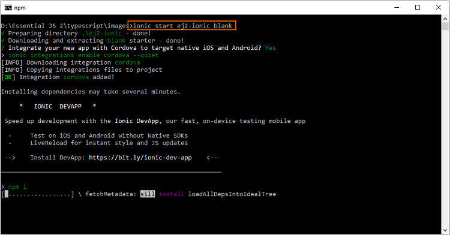
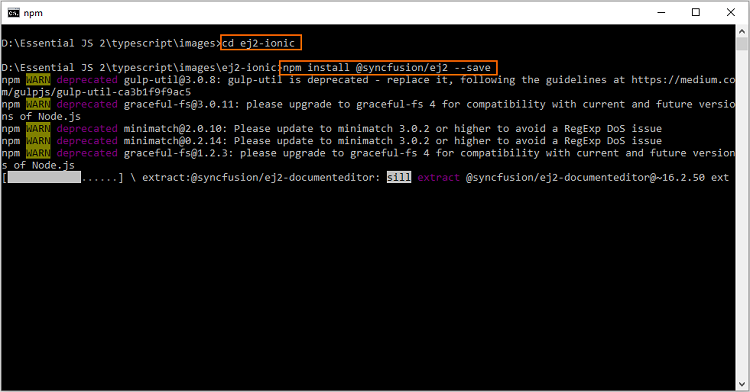
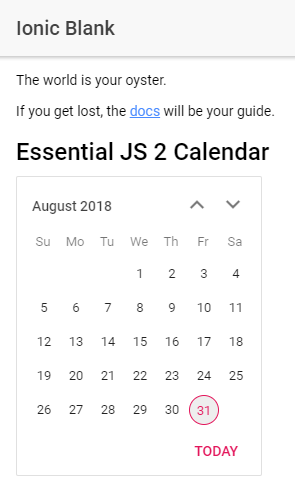

# Getting Started with Syncfusion JavaScript (Essential JS 2) library and Ionic Framework

This article provides a step-by-step introduction to configure Syncfusion JavaScript (Essential JS 2) library and build it in the Ionic framework.

## Prerequisites

* [Node.js](https://nodejs.org/en/)
* [Visual Studio Code](https://code.visualstudio.com/)

## Setup development environment

1.Open the command prompt, and run the following command line to install the `ionic` with global flag.

    on Windows:

    ```
    npm install -g ionic cordova
    ```

    on OSX / LINUX:

    ```
    sudo npm install -g ionic cordova
    ```

2.Then, run the following command line to create a new Ionic blank template application. The new application will be placed under `ej2-ionic` folder after the command complete its process, and it will install the default `npm` dependent packages when creating the application.

    ```
    ionic start ej2-ionic blank
    ```

    > The list of available starter template can be listed by running `ionic start --list` command line.

    

    > Type `yes` and press the <kbd>Enter</kbd> key if the application needs to be integrated with Cordova to target native IOS and Android.

## Configuring Syncfusion JavaScript UI control in application

1.Navigate to the `ej2-ionic` folder from the command prompt, and install the [`@syncfusion/ej2`](https://www.npmjs.com/package/@syncfusion/ej2) npm package in the application using the following command line.

    ```
    cd ej2-ionic
    npm install @syncfusion/ej2 --save
    ```

    

2.For getting started, the Calendar control will be added in the new application. Open the application in Visual Studio Code, and add the `<div>` element inside the `<ion-content>` element in `~/src/app/home/home.page.html` file for rendering the Calendar control.

    ```
    <ion-header>
        ....
        ....
    </ion-header>

    <ion-content padding>
        ....
        ....

        <h2>Essential JS 2 Calendar</h2>
        <!--HTML element which is going to render as Essential JS 2 Calendar control-->
        <div id="element"></div>
    </ion-content>
    ```

3.Import the Calendar class from `@syncfusion/ej2-calendars` package, and render the Calendar control inside the `platform.ready()` method's callback function of `MyApp` class in `~/src/app/home/home.page.ts` file.

    ```ts
    ....
    ....
    import { Calendar } from "@syncfusion/ej2-calendars";

    @Component({
        templateUrl: 'home.page.html'
    })

    export class MyApp {
        rootPage:any = HomePage;

        constructor(platform: Platform, statusBar: StatusBar, splashScreen: SplashScreen) {
            platform.ready().then(() => {
                ....
                ....

                // initialize calendar control
                let calendarObject = new Calendar();

                // render initialized calendar
                calendarObject.appendTo('#element');
            });
        }
    }
    ```

4.Add the Syncfusion JavaScript styles inside `<head>` element in `~/src/index.html` file.

    ```
    <!DOCTYPE html>
    <html lang="en" dir="ltr">
        <head>
            ....
            ....
            <!-- Essential JS 2 styles -->
            <link href="https://cdn.syncfusion.com/ej2/material.css" rel="stylesheet">
        </head>

        <body>
            ....
            ....
        </body>
    </html>
    ```

5.Finally, run the following command line to start the Ionic application.

    ```
    ionic serve
    ```

    The Calendar control will be rendered in the Ionic application as shown in the following screenshot.

    