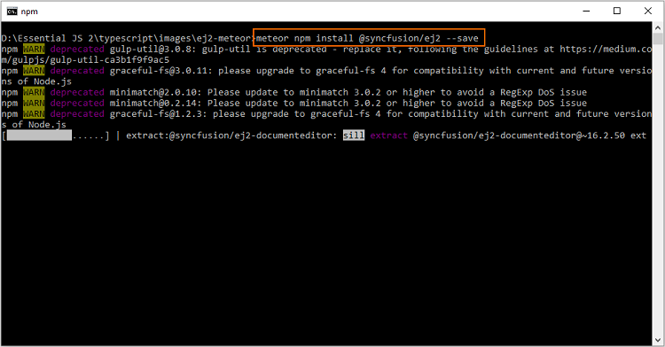

# Getting Started with Syncfusion JavaScript (Essential JS 2) library and Meteor Framework

This article provides a step-by-step introduction to configure Syncfusion JavaScript (Essential JS 2) library and build it in the Meteor framework.

## Prerequisites

* [Node.js](https://nodejs.org/en/)
* [chocolatey](https://chocolatey.org/install)
* [Visual Studio Code](https://code.visualstudio.com/)

## Setup development environment

1.Open the command prompt from **administrator** mode, and install the `Meteor` using the following command line.

    on Windows:

    ```
    choco install meteor
    ```

    on OSX/LINUX:

    ```
    curl https://install.meteor.com/ | sh
    ```

    > Refer to [this documentation](https://www.meteor.com/install) for more information about installing `Meteor`.

2.Run the following command line to create a new project under `ej2-meteor` folder after installing `Meteor`.

    ```
    meteor create ej2-meteor
    ```


3.Now, navigate to the created project location `ej2-meteor`, and install the required default dependencies from the command prompt.

    ```
    cd ej2-meteor
    meteor npm install
    ```


## Configure Essential JS 2 control in application

1.Install the [`@syncfusion/ej2`](https://www.npmjs.com/package/@syncfusion/ej2) npm package in the application using the following command line.

    ```
    meteor npm install @syncfusion/ej2 --save
    ```



    For getting started, the Calendar control will be added in the new application.

2.Open the application in Visual Studio Code, and add the `<div>` element inside the `<body>` element in `~/client/main.html` file for rendering the Calender control.

    ```
    <head>
        <title>ej2-meteor</title>

        ....
        ....
    </head>

    <body>
        ....
        ....

        <h2>Essential JS 2 Calendar</h2>
        <!--HTML element which is going to render as Essential JS 2 Calendar control-->
        <div id="element"></div>
    </body>

    ....
    ....
    ```

3.Then, import the Syncfusion JavaScript styles, and render the Calender control inside the `Meteor.startup` method in `~/src/client/main.js` file.

    ```js
    ....
    ....

    import './main.html';

    // import Syncfusion Essential JS 2 styles from node_modules
    import '../node_modules/@syncfusion/ej2/material.css';

    import { Calendar } from '@syncfusion/ej2-calendars';

    Meteor.startup(() => {
        // initialize calendar control
        let calendarObject = new Calendar();

        // render initialized calendar
        calendarObject.appendTo('#element');
    });

    ....
    ....

    ```

4.Finally, run the following command line to run the Meteor application.

    ```
    meteor
    ```

    Open the localhost URL in the web brower.


    The Calendar control will now be rendered in the browser.


    > If you face any memory issue when running the above command line, increase the memory by adding `TOOL_NODE_FLAGS --max-old-space-size=4096` system environment variable. Refer to this [GitHub issue](https://github.com/meteor/meteor/issues/9568#issuecomment-359785483) for more information.

### Running on mobile emulator/simulator

Refer to this [tutorial](https://www.meteor.com/tutorials/blaze/running-on-mobile) for running the `Meteor` application in mobile emulator or simulator. Meteor on Windows does not support mobile builds, so this will not work on Windows.
