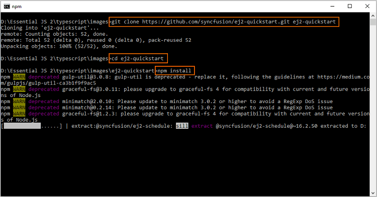

# Getting Started with Syncfusion JavaScript (Essential JS 2) library from a seed application

This article provides a step-by-step guide to configuring the Syncfusion JavaScript (Essential JS 2) library and building a simple JavaScript web application using the GitHub [quickstart](https://github.com/SyncfusionExamples/ej2-quickstart-webpack-) seed repository.

> This application is integrated with the `webpack.config.js` configuration and uses the latest version of the [webpack-cli](https://webpack.js.org/api/cli/#commands). It requires node `v14.15.0` or higher. For more information about webpack and its features, refer to the [webpack documentation](https://webpack.js.org/guides/getting-started/).

## Prerequisites

To get started with application, ensure the following software to be installed in the machine.

* [git](https://git-scm.com/downloads)
* [Node.js](https://nodejs.org/en/)
* [Visual Studio Code](https://code.visualstudio.com/)

## Set up development environment

Open the command prompt from the required directory, and run the following command to clone the Syncfusion JavaScript (Essential JS 2) quickstart project from [GitHub](https://github.com/SyncfusionExamples/ej2-quickstart-webpack-).

```
    git clone https://github.com/SyncfusionExamples/ej2-quickstart-webpack- ej2-quickstart
```

After cloning the application in the `ej2-quickstart` folder, run the following command line to navigate to the `ej2-quickstart` folder.

```
    cd ej2-quickstart
```

## Add Syncfusion JavaScript packages

Syncfusion JavaScript (Essential JS 2) packages are available on the [npmjs.com](https://www.npmjs.com/~syncfusionorg) public registry. You can install all Syncfusion JavaScript (Essential JS 2) controls in a single [@syncfusion/ej2](https://www.npmjs.com/package/@syncfusion/ej2) package or individual packages for each control.

The quickstart application is preconfigured with the dependent [@syncfusion/ej2](https://www.npmjs.com/package/@syncfusion/ej2) package in the `~/package.json` file. Use the following command to install the dependent npm packages from the command prompt.

```
    npm install
```


> To learn more about the individual packages and different ways to install them, refer [here](https://ej2.syncfusion.com/documentation/installation-and-upgrade/installation/).

## Import the Syncfusion CSS styles

Syncfusion JavaScript controls come with [built-in themes](https://ej2.syncfusion.com/documentation/appearance/theme/), which are available in the installed packages. It's easy to adapt the Syncfusion JavaScript controls to match the style of your application by referring to one of the built-in themes.

The quickstart application is preconfigured to use the `Material` theme in the `~/src/styles/styles.css` file, as shown below: 

```
  @import "../../node_modules/@syncfusion/ej2/material.css";
```

> You can check out the [themes](https://ej2.syncfusion.com/documentation/appearance/theme/) section to know more about built-in themes and CSS reference for individual controls.

## Add Syncfusion control to the application

Open the application in Visual Studio Code and add the Syncfusion JavaScript UI controls. 

In this article, the Grid control is used as an example. Add the following Grid element to the `~/src/index.html` file.

```html
    <!DOCTYPE html>
    <html lang="en">

    <head>
        <title>Essential JS 2</title>
        <meta charset="utf-8" />
        <meta name="viewport" content="width=device-width, initial-scale=1.0, user-scalable=no" />
        ....
        ....
    </head>

    <body>
        <div>
            <!--HTML grid element, which is going to render as Essential JS 2 Grid-->
            <div id="Grid"></div>
        </div>
    </body>

    </html>
 ```

To render the Grid control, add the following JavaScript code to the `~/src/app/app.ts` file

```ts
    import { Grid } from '@syncfusion/ej2-grids';
    
    // Grid data
    const data: Object[] = [
        {
            OrderID: 10248, CustomerID: 'VINET', EmployeeID: 5, OrderDate: new Date(8364186e5),
            ShipName: 'Vins et alcools Chevalier', ShipCity: 'Reims', ShipAddress: '59 rue de l Abbaye',
            ShipRegion: 'CJ', ShipPostalCode: '51100', ShipCountry: 'France', Freight: 32.38, Verified: !0
        },
        {
            OrderID: 10249, CustomerID: 'TOMSP', EmployeeID: 6, OrderDate: new Date(836505e6),
            ShipName: 'Toms Spezialitäten', ShipCity: 'Münster', ShipAddress: 'Luisenstr. 48',
            ShipRegion: 'CJ', ShipPostalCode: '44087', ShipCountry: 'Germany', Freight: 11.61, Verified: !1
        },
        {
            OrderID: 10250, CustomerID: 'HANAR', EmployeeID: 4, OrderDate: new Date(8367642e5),
            ShipName: 'Hanari Carnes', ShipCity: 'Rio de Janeiro', ShipAddress: 'Rua do Paço, 67',
            ShipRegion: 'RJ', ShipPostalCode: '05454-876', ShipCountry: 'Brazil', Freight: 65.83, Verified: !0
        }
    ];

    // initialize grid control
    let grid: Grid = new Grid({
        dataSource: data,
        columns: [
                { field: 'OrderID', headerText: 'Order ID', textAlign: 'Right', width: 120, type: 'number' },
                { field: 'CustomerID', width: 140, headerText: 'Customer ID', type: 'string' },
                { field: 'EmployeeID', width: 140, headerText: 'Employee ID', textAlign: 'Right', type: 'string' },
                { field: 'Freight', headerText: 'Freight', textAlign: 'Right', width: 120, format: 'C' },
                { field: 'OrderDate', headerText: 'Order Date', width: 140, format: 'yMd' }
        ]
    });

    // render initialized grid
    grid.appendTo('#Grid');
```

## Run the application

Now, run the application in the browser using the following command.

```
    npm start
```

 







        


To learn more about the functionality of the Grid control, refer to the [documentation](https://ej2.syncfusion.com/documentation/grid/getting-started/).

## See also

* [How to register Syncfusion license key in JavaScript(ES6) application](https://ej2.syncfusion.com/documentation/licensing/license-key-registration/)
