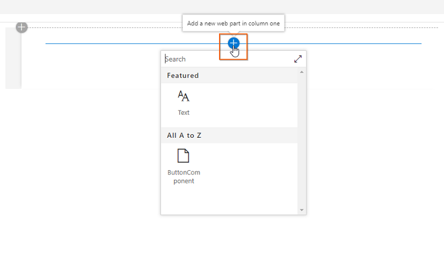
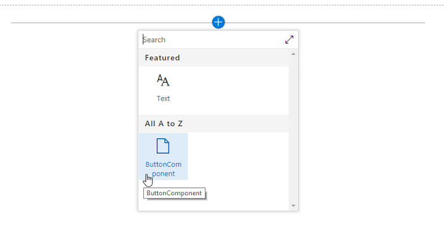
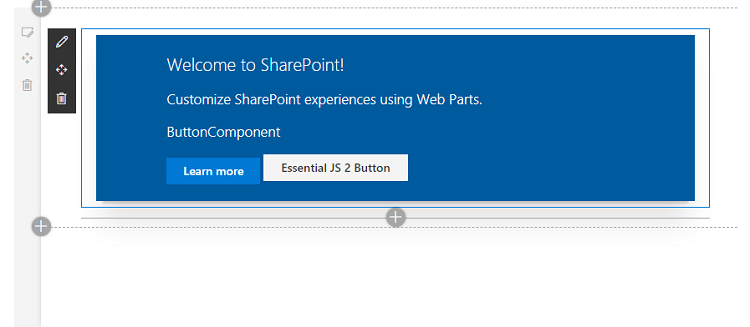

# Syncfusion® JS (Essential® JS 2) and SharePoint Framework (SPFx)

This article provides a step-by-step introduction to configure Syncfusion<sup style="font-size:70%">&reg;</sup> JavaScript (Essential<sup style="font-size:70%">&reg;</sup> JS 2) library and build a simple SharePoint framework application in Visual Studio Code.

## Prerequisites

* [Node.js](https://nodejs.org/en/)
* [Visual Studio Code](https://code.visualstudio.com/)

## Setup development environment

1.Create a new directory `ej2-sharepoint`, open the command prompt from that directory, and install the required SharePoint client-side development tools with global flag.



npm install -g yo gulp @microsoft/generator-sharepoint



sudo npm install -g yo gulp @microsoft/generator-sharepoint



> The Yeoman SharePoint web part generator [`@microsoft/generator-sharepoint`](https://www.npmjs.com/package/@microsoft/generator-sharepoint) helps to create a SharePoint client-side project using [`Yeoman`](http://yeoman.io/) tool.

2.Then, create a new client-side web part by running the Yeoman SharePoint Generator.

 ```
yo @microsoft/sharepoint
 ```

3.Set up the following options when the above command is prompted.

1. **Solution Name** - Type: `ej-2-sharepoint` (or any name you want)
2. Choose **WebPart** as the client-side component type to be created.

Next, it will ask the specific information about the web part.

1. Change the **ButtonComponent** as your web part name
2. **Select Framework** - Choose **No Framework**

4.After configuring the above setup, the Yeoman generator will create the SharePoint client-side web part under `ej2-sharepoint` folder and install the required default dependencies.

## Configure Syncfusion<sup style="font-size:70%">&reg;</sup> JavaScript UI control in application

1.Install the [`@syncfusion/ej2-buttons`](https://www.npmjs.com/package/@syncfusion/ej2-buttons) package and required theme package from npm in the application using the following command line.

```
npm install @syncfusion/ej2-buttons @syncfusion/ej2-fabric-theme --save
```

2.Open the SharePoint application in Visual Studio Code, and add the Syncfusion<sup style="font-size:70%">&reg;</sup> JavaScript Button control script and styles in the `~/src/webparts/buttonComponent/ButtonComponentWebPart.ts` file.

1. Import the Button source and add Syncfusion<sup style="font-size:70%">&reg;</sup> JavaScript style reference at the top of the file.
2. Add the HTML button element in `this.domElement.innerHTML`, and initialize the Syncfusion<sup style="font-size:70%">&reg;</sup> JavaScript Button in the `render()` method of `ButtonComponentWebPart` class.

 ```ts
....
....

import styles from './ButtonComponentWebPart.module.scss';
import * as strings from 'ButtonComponentWebPartStrings';

// import Essential JS 2 Button
import { Button } from '@syncfusion/ej2-buttons';

// add Syncfusion Essential JS 2 style reference from node_modules
require('../../../node_modules/@syncfusion/ej2-fabric-theme/styles/fabric.css');

....
....

export default class ButtonComponentWebPart extends BaseClientSideWebPart<IButtonComponentWebPartProps> {

    public render(): void {
    this.domElement.innerHTML = `
        <div class="${ styles.buttonComponent }">
            ....
            ....

            <!--HTML button element, which is going to render as Essential JS 2 Button-->
            <button id="normalbtn">Essential JS 2 Button</button>
        </div>`;

        // initialize button control
        let button: Button = new Button();

        // render initialized button
        button.appendTo('#normalbtn');
    }

    ....
    ....
}
 ```

3.Set your tenant domain in the `serve.json` file located in the `config` folder.

 ```
{
  "$schema": "https://developer.microsoft.com/json-schemas/spfx-build/spfx-serve.schema.json",
  "port": 4321,
  "https": true,
  "initialPage": "https://{tenantDomain}/_layouts/workbench.aspx"
}
 ```

4.Run the application using the following command line, and the Syncfusion<sup style="font-size:70%">&reg;</sup> JavaScript Button control will be rendered in web browser.

 ```
gulp serve
 ```

Click the `Add a new web part in column one`.



Select the `ButtonComponent` web part.



Finally, the Syncfusion<sup style="font-size:70%">&reg;</sup> JavaScript Button control is rendered in the SharePoint Framework client-side web part.

