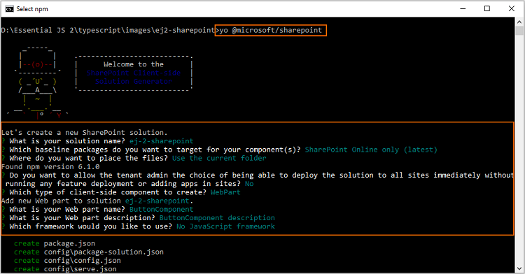
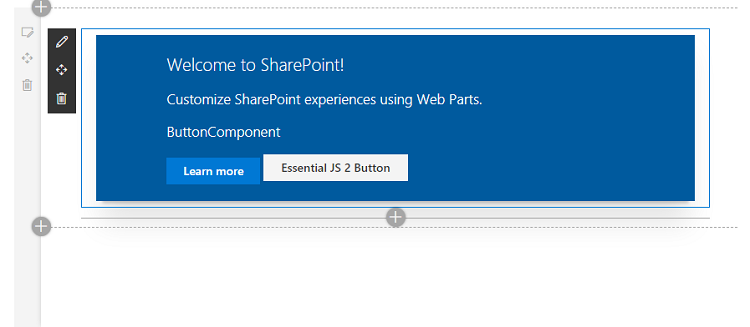

# Getting Started with Syncfusion<sup style="font-size:70%">&reg;</sup> JavaScript (Essential<sup style="font-size:70%">&reg;</sup> JS 2) library and SharePoint Framework (SPFx)

This article provides a step-by-step introduction to configure Syncfusion<sup style="font-size:70%">&reg;</sup> JavaScript (Essential<sup style="font-size:70%">&reg;</sup> JS 2) library and build a simple SharePoint framework application in Visual Studio Code.

## Prerequisites

* [Node.js](https://nodejs.org/en/)
* [Visual Studio Code](https://code.visualstudio.com/)

## Setup development environment

1.Create a new directory `ej2-sharepoint`, open the command prompt from that directory, and install the required SharePoint client-side development tools with global flag.

    on Windows:

 ```
    npm install -g yo gulp @microsoft/generator-sharepoint
 ```

    on OSX / LINUX

 ```
    sudo npm install -g yo gulp @microsoft/generator-sharepoint
 ```

    > The Yeoman SharePoint web part generator [`@microsoft/generator-sharepoint`](https://www.npmjs.com/package/@microsoft/generator-sharepoint) helps to create a SharePoint client-side project using [`Yeoman`](http://yeoman.io/) tool.

2.Then, create a new client-side web part by running the Yeoman SharePoint Generator.

 ```
    yo @microsoft/sharepoint
 ```

3.Set up the following options when the above command is prompted.

    1. Accept the default **ej-2-sharepoint** as your solution name, and then press the <kbd>Enter</kbd> key.
    2. Choose **SharePoint Online only (latest)**, and press the <kbd>Enter</kbd> key.
    3. Choose **Use the current folder** to place the files in current location, and press the <kbd>Enter</kbd> key.
    4. Type **N** to require the extension to be installed on each site explicitly when it is being used.
    5. Choose **WebPart** as the client-side component type to be created.

    Next, it will ask the specific information about the web part.

    1. Change the **ButtonComponent** as your web part name, and then press the <kbd>Enter</kbd> key.
    2. Accept the default **ButtonComponent description** as your web part description, and then press the <kbd>Enter</kbd> key.
    3. Accept the default **No javascript framework** as the framework, and then press the <kbd>Enter</kbd> key.



4.After configuring the above setup, the Yeoman generator will create the SharePoint client-side web part under `ej2-sharepoint` folder and install the required default dependencies.

## Configure Syncfusion<sup style="font-size:70%">&reg;</sup> JavaScript UI control in application

1.Install the [`@syncfusion/ej2`](https://www.npmjs.com/package/@syncfusion/ej2) npm package in the application using the following command line.

 ```
    npm install @syncfusion/ej2 --save
 ```

2.Open the SharePoint application in Visual Studio Code, and add the Syncfusion<sup style="font-size:70%">&reg;</sup> JavaScript Button control script and styles in the `~/src/webparts/buttonComponent/ButtonComponentWebPart.ts` file.

    1. Import the Button source and add Syncfusion<sup style="font-size:70%">&reg;</sup> JavaScript style reference at the top of the file.
    2. Add the HTML button element in `this.domElement.innerHTML`, and initialize the Syncfusion<sup style="font-size:70%">&reg;</sup> JavaScript Button in the `render()` method of `ButtonComponentWebPart` class.

 ```ts
    ....
    ....

    import styles from './ButtonComponentWebPart.module.scss';
    import * as strings from 'ButtonComponentWebPartStrings';

    // import Essential JS 2 Button
    import { Button } from '@syncfusion/ej2-buttons';

    // add Syncfusion Essential JS 2 style reference from node_modules
    require('../../../node_modules/@syncfusion/ej2/fabric.css');

    ....
    ....

    export default class ButtonComponentWebPart extends BaseClientSideWebPart<IButtonComponentWebPartProps> {

        public render(): void {
        this.domElement.innerHTML = `
            <div class="${ styles.buttonComponent }">
                ....
                ....

                <!--HTML button element, which is going to render as Essential JS 2 Button-->
                <button id="normalbtn">Essential JS 2 Button</button>
            </div>`;

            // initialize button control
            let button: Button = new Button();

            // render initialized button
            button.appendTo('#normalbtn');
        }

        ....
        ....
    }
 ```

3.Run the application using the following command line, and the Syncfusion<sup style="font-size:70%">&reg;</sup> JavaScript Button control will be rendered in web browser.

 ```
    gulp serve
 ```

    Click the `Add a new web part in column one`.


    Select the `ButtonComponent` web part.


    Finally, the Syncfusion<sup style="font-size:70%">&reg;</sup> JavaScript Button control is rendered in the SharePoint Framework client-side web part.

